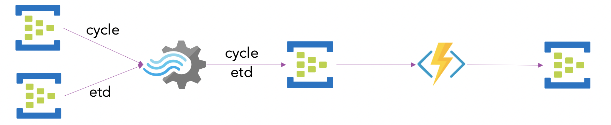

# MythicalStreamsASA
Demonstrates the following pattern to combine 2 streams into a single stream for downstream processing


## EHMessageGenerator
A GoLang based message generator, that reads the files
*   cycle.json
*   etd.json

These files ares loaded by the program and specific tags are parsed and replaced with values.

```javascript
		"trackingID": "<TRACKINGID>",
			"sourceTimeStamp": "<SRCTIMESTAMP>",
			"HubTimeStamp": "<HUBTIMESTAMP>"
			"fltNum": "<FLTNUM>",
			"depSta": "<DEP>",
			"arr": "<ARR>",
```
The messagees are sent to EventHub for processing

## DSS
Is the Azure Stream Analytics Job that is primarily used to bring these two streams of cycle and etd together.

```
WITH   
STEP1 AS  
(  
    SELECT flight.event, flight   
    FROM cycle TIMESTAMP BY EventEnqueuedUtcTime   
    UNION  
    SELECT flight.event, flight     
    FROM etd TIMESTAMP BY EventEnqueuedUtcTime
)

SELECT  *
INTO merged FROM STEP1
```

## EHMessageReader
The readers provides the ability to peak into Event Hub for observability on the messages

## EHMessageTrigger
A Java Azure Function that triggers on every event in the event hub. As ASA writes the combined streams into the merged eventhub, the function gets triggered to process it.